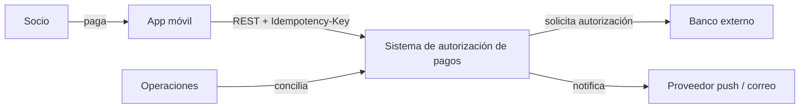
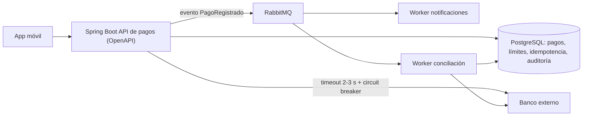
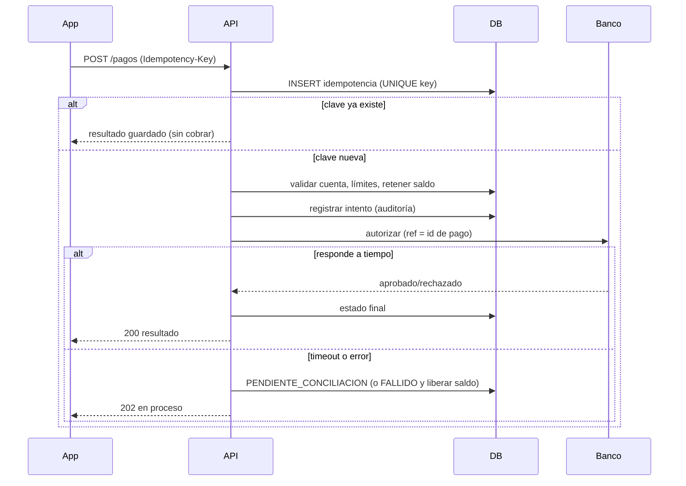

# Ejercicio 2: Autorización de pagos

## 1. Objetivo, actores y alcance
**Objetivo:** autorizar pagos desde la app móvil de la cooperativa validando cuenta y límites, sin cobrar dos veces y registrando cada intento aunque falle un servicio externo.

**Actores:** socio (app móvil), banco externo, equipo de operaciones/conciliación, auditor.

**Alcance:** solicitud de pago, validación, llamada al banco, respuesta al cliente, notificación y conciliación posterior. **Fuera de alcance:** alta de cuentas, contracargos y disputas.

## 2. Requisitos
**Funcionales:** RF1 validar cuenta. RF2 verificar límites (por pago y diario) y fondos. RF3 registrar todo intento. RF4 solicitar autorización al banco. RF5 responder al cliente con estado claro. RF6 notificar. RF7 conciliar contra el banco.

**Calidad:** idempotencia (cero cobros duplicados), consistencia (saldo y límites sin carreras), latencia de autorización p95 < 3 s, auditabilidad completa, resiliencia a fallas del banco, seguridad (TLS, datos enmascarados).

## 3. C4: Contexto

## 3b. C4: Contenedores

## 4. Flujo crítico: solicitud de pago

## 5. Decisiones
**Pasos síncronos (el usuario espera):** validar solicitud e idempotencia, validar cuenta, verificar límites y fondos, registrar el intento y llamar al banco con timeout. Es lo mínimo para responder "aprobado / rechazado / en proceso".

**Pasos en segundo plano:** notificación al socio, conciliación, reintentos de consulta de estado al banco, reportes y alertas. Ninguno debe aumentar la latencia ni hacer fallar el pago.

**Evitar cobro doble:** header `Idempotency-Key` generado por la app por cada intención de pago. Se guarda en una tabla con `UNIQUE(key)` y un hash del cuerpo. Un reintento con la misma clave devuelve el resultado guardado; la misma clave con otro cuerpo devuelve 422. La referencia enviada al banco es nuestro id de pago, así que el banco también deduplica. El saldo y el límite se retienen en una transacción antes de llamar al banco.

**Auditoría:** quién (usuario, dispositivo, IP), cuándo, clave de idempotencia, correlation-id, cuenta enmascarada, monto, resultado y motivo de rechazo, referencia del banco, latencia de la llamada, versión del servicio. Tabla append-only; nunca se guardan claves ni datos sensibles completos.

**Si el banco responde tarde o no responde:** timeout corto (2 s). Si hay timeout, el pago pasa a `PENDIENTE_CONCILIACION`, los fondos quedan retenidos y se responde 202 "en proceso". Nunca se reintenta el cobro a ciegas: primero se consulta el estado por referencia y una conciliación posterior compara contra el registro del banco; si el banco no lo tiene tras varias consultas, se liberan los fondos. Si el error es claro (banco caído), se marca `FALLIDO` y se liberan los fondos: no hubo cobro. Un circuit breaker evitaría saturar al banco caído (fase 2).

## 6. Stack
Spring Boot + OpenAPI (contrato claro con la app), PostgreSQL (ACID para saldos y auditoría), Docker, RabbitMQ para notificaciones y conciliación (colas y reintentos simples; Kafka sería excesivo al inicio). Claves de idempotencia en la base.

## 7. ADR
**ADR-001 (arquitectura): autorización síncrona con estado "pendiente" y conciliación asíncrona.** *Decisión:* la API responde en un tiempo acotado y delega lo incierto a conciliación. *Consecuencias:* el usuario nunca espera indefinidamente y se evita el doble cobro; se acepta un estado intermedio que la app debe mostrar.

**ADR-002 (tecnología): idempotencia con UNIQUE en la base de datos transaccional en vez de Redis.** *Decisión:* la deduplicación vive en la misma base y transacción que el pago. *Consecuencias:* garantía fuerte y sin sistema extra; algo más de carga en la base, que se limpia con retención (p. ej. 30 días).

## 8. Riesgos
| Riesgo | Mitigación |
|---|---|
| Doble cobro por reintentos | Idempotency-Key + UNIQUE + referencia al banco |
| Banco lento deja pagos en limbo | Timeout, estado pendiente, conciliación por referencia, liberación de fondos |
| Fuga de datos en logs/auditoría | Enmascarar cuentas, no registrar secretos, acceso por rol |

## 9. Métricas
**Negocio:** pagos duplicados (meta 0) y tiempo de conciliación.
**Técnica:** latencia de autorización p95 y tasa de errores (todas se ven en la pantalla).

## 10. Prototipo ejecutable e infraestructura como código
Para correr sin dependencias, el prototipo usa **Python (librería estándar) + SQLite**; el diseño objetivo (Spring Boot + PostgreSQL + RabbitMQ) conserva los mismos contratos.

| Archivo | Para qué sirve |
|---|---|
| `server.py` | API de pagos, idempotencia, límites, banco simulado, conciliación, auditoría |
| `index.html` | Interfaz (consume la API) |
| `Dockerfile` | Imagen con healthcheck |
| `docker-compose.yml` | Servicio, puerto 8000 y volumen persistente |
| `.github/workflows/ci.yml` | Construye y prueba `/api/health` en cada push |

**Ejecutar:** `docker compose up --build -d` y abrir el puerto 8000. **Reiniciar datos:** `docker compose down -v` (o el botón "Reiniciar demo").

**API:** `POST /api/pay` (header `Idempotency-Key`, cuerpo `{account, amount}`), `POST /api/bank {mode: ok|slow|down}`, `POST /api/reconcile`, `GET /api/accounts|payments|audit|metrics|health`.

**Qué probar:** pagar dos veces con la misma clave; pagar $400 (límite) o $900 (fondos); poner el banco en "tarde", pagar, esperar 5 s y ejecutar la conciliación; poner el banco en "no responde" y verificar que el saldo no cambia.
